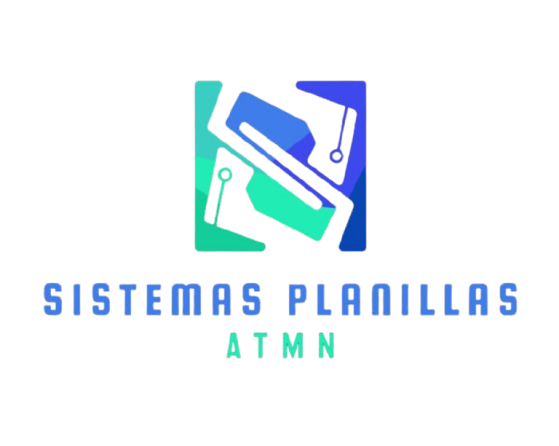

# Control de Asistencia y Sistema de Nómina

Este Control de Asistencia y Sistema de Nómina hecho en PHP y MySQL gestiona los pagos de nómina según los cargos que se crean dentro de la aplicación y las horas que reportan dentro del sistema, está aplicación incluso controla adelantos y deducciones. Esta hecho con fines educativo como proyecto de programacion IV. 

# Contacto

Si tienes dudas sobre el funcionamiento de la aplicación o requieres un desarrollo a medida me puedes contactar en el siguiente enlace de Whatsapp:
https://api.whatsapp.com/send?phone=50761613075
